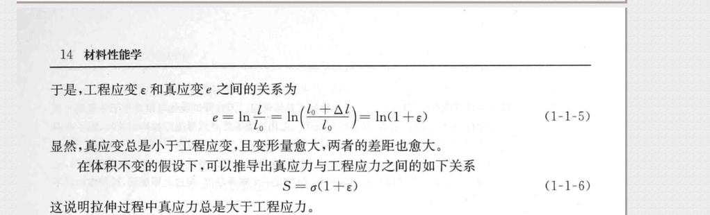
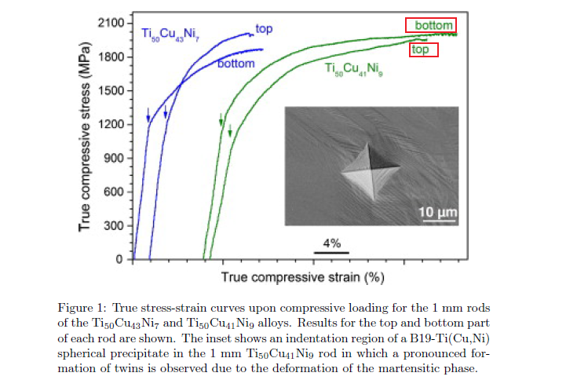

# 《材料力学行为》课程相关问题

- 作者：小小角色、走楼梯啊
- 创建时间：2022.11.07
- 不定期更新
- 以下内容如有错误或疑问，或友好交流互动，请在该 repo 中提 [Issues](https://gitee.com/yangsl306/MMB-course-questions/issues/new)

---

## 课程小测什么时候进行？几次？相当于期中考试？

课程小测时间不定，次数根据老师课程规划而定。

课程小测只是检测同学对当天课堂课程所学知识的吸收掌握情况，认真听课即可。

---

## 作业有修改导致多次提交作业，是否有影响？

在作业提交截止时间前或稍微晚一点点，多次提交没有影响。

但还是要及时提交作业哦。

---

## 压缩实验中的屈服应力、抗压强度和长度缩减率是正值还是负值？

解答：

均为正值。

---

## 02-StressState 课件中的莫尔圆公式中的正负号应该反过来？

解答：

从下面的三张图与上面的图对比可以看出，两者的切应力方向是相反的，所以，课件中的公式正负号并无问题。

>图片来源：刘鸿文《材料力学 I》第六版 7.4 节图解法

- 切应力正方向如何取？

如下图所示：

>图片来源：刘鸿文《材料力学 I》第六版，第 7 章，第几节有些忘了，应该在 7.4 节前面

## 拉伸过程中体积保持不变只是假设吗？

解答：

是的，一般都认为体积保持不变。

>图片来源：张帆, 《材料性能学》第 2 版，正文第 14 页

- 若拉伸过程中体积发生变化，书中的真应力、真应变公式应该不是最最真实的吧？

是的。

- 若想获得真实的真应力的话（假设体积发生变化），应该怎么实时测横截面积？

（实时测横截面积的拉伸试验还没见过）

或许可以在试样的某个部位（如靠试样中间附近的位置）缠绕一个线圈，这个线圈类似一种传感器，实时感知其周长变化；

或者在试样中间放一个激光/红外线测距的传感器，实时检测某一个点的距离变化，从而得到试样半径的变化。

（以上为自己的想法）

---

## Week03 作业中的第三题，为什么要测 top 和 bottom 两个位置的应力应变？

解答：

题干中有提到原文献来源，查找原文献，有一段描述中提到为什么要测 top 和 bottom 两个位置的应力应变的原因。

大意为：为了进一步表征，1mm 杆分为底部和顶部两部分，2mm 杆分三部分，底部、中部和顶部。这一分类很重要，因为在铜模吸铸时，由于自下而上的冷却速度降低，可能会产生异质微观结构。

>文献来源: Acta Materialia 61(1):151-162,2013.
>
>https://doi.org/10.1016/j.actamat.2012.09.042

- 上图中的四条应力应变曲线中，有的起点不在原点处？

个人认为是为了区分出四条曲线，都放在原点，不美观，且不容易区分读取弹性阶段的临界区域和相关数值。

---

## 广义胡克定律中的弹性刚度矩阵为什么是对称阵？

解答：

这个涉及到弹性力学中的知识。

>图片来源：沈耀老师《材料强度学》课件《弹性力学》部分
